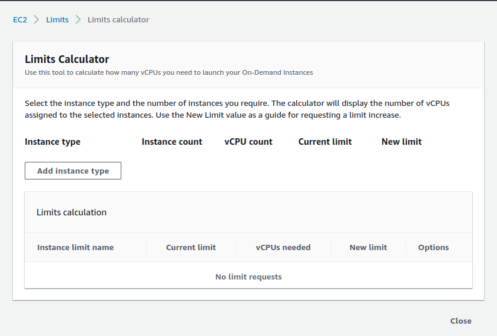
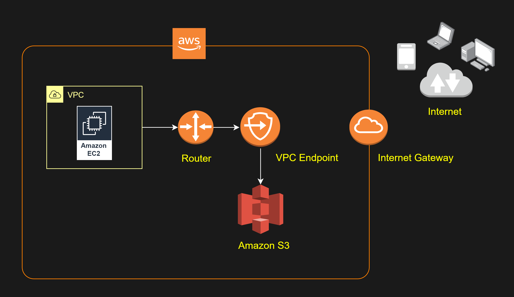

# Notas de estudo para SAA-C02

**ATENÇÃO**: Esse não é um material que cobre 100% da prova, estou anotando somente tópicos que estou revisando antes do exame e pretendo acertar o índice e a ordem dos tópicos conforme avançar nos estudos. 

- Se você já tem familiaridade com AWS, recomendo NÃO comprar cursos e partir direto para practice exams até você ficar confiante e começar a acertar mais de 85% entendendo o contexto das questões, sem mera decoreba
- Repositório com minhas notas de estudo para a certificação de Solutions Architect - Associate, da Amazon.
- [Comparison of AWS Services Cheat Sheets](https://tutorialsdojo.com/comparison-of-aws-services/)
- Recomendo fortemente os testes do Jon Bonso, comprei pelo [Udemy](https://www.udemy.com/course/aws-certified-solutions-architect-associate-amazon-practice-exams-saa-c03/)
  - **Lembre de tentar em aba anônima para não comprar pelo preço cheio**
  - A maioria dos links de referência aqui é com base nas questões que eu revisei dos practice exams e os cheat sheets são todos do Tutorials Dojo, do Jon Bonso
## Índice
- [Notas de estudo para SAA-C02](#notas-de-estudo-para-saa-c02)
  - [Índice](#índice)
  - [Armazenamento e Migração de Dados](#armazenamento-e-migração-de-dados)
    - [S3](#s3)
    - [Snowball](#snowball)
    - [StorageGateway](#storagegateway)
    - [AWS DataSync](#aws-datasync)
    - [S3 Transfer Acceleration](#s3-transfer-acceleration)
    - [RRS](#rrs)
    - [Hospedando um website com S3](#hospedando-um-website-com-s3)
    - [Cloudfront](#cloudfront)
      - [Lambda@Edge](#lambdaedge)
  - [EC2](#ec2)
    - [Billing @ EC2](#billing--ec2)
    - [Placement Groups](#placement-groups)
    - [EBS](#ebs)
    - [Snapshots](#snapshots)
    - [Data Lifecycle Manager](#data-lifecycle-manager)
    - [User Data](#user-data)
    - [Instance Hibernation](#instance-hibernation)
    - [Security Groups](#security-groups)
    - [EFS](#efs)
    - [File Storages](#file-storages)
      - [FSx for Windows File Systems](#fsx-for-windows-file-systems)
  - [AWS Marketplace](#aws-marketplace)
  - [WAF](#waf)
  - [Bases de Dado AWS](#bases-de-dado-aws)
    - [Relational](#relational)
    - [Aurora Serverless](#aurora-serverless)
    - [Aurora Global Database](#aurora-global-database)
    - [DynamoDB](#dynamodb)
    - [Elasticache](#elasticache)
    - [Redshift](#redshift)
    - [Amazon Aurora](#amazon-aurora)
    - [IAM DB](#iam-db)
  - [Kinesis & Streams](#kinesis--streams)
  - [Route53](#route53)
    - [Route53 and S3 Website Hosting](#route53-and-s3-website-hosting)
  - [VPC](#vpc)
    - [Gateway e Interface Endpoints](#gateway-e-interface-endpoints)
    - [NAT](#nat)
    - [LoadBalancing](#loadbalancing)
  - [IAM](#iam)
    - [AWS Config](#aws-config)
    - [SQS e SWF](#sqs-e-swf)
    - [SNS](#sns)
  - [Serverless Lambda](#serverless-lambda)
  - [Cloudformation](#cloudformation)
  - [Cloudwatch](#cloudwatch)
  - [API Gateway](#api-gateway)

---
## Armazenamento e Migração de Dados
### S3

Ou Simple storage Service, serviço de armazenamento com alta disponibilidade e durabilidade. Possui diversas classes de armazenamento. Possuem classes de armazenamento que no geral se baseiam na frequência de acesso:

* Frequente:
  * Standard
    * Mais comum, para objetos com acesso frequente
    * 99.999999999% (nove dígitos após a vírgula) de durabilidade
    * 99.999999999% de disponibilidade
* Infrequente:
  * Standard-IA
  * Glacier Deep Storage
    * Restore leva algumas horas
* Frequência Desconhecida ou que pode alterar
  * S3 Intelligent-Tiering
    * Movimenta automaticamente entre classes de acesso baseado na frequência que um arquivo é solicitado

**Importante**:
* Bucket names são globais e, portanto, únicos
* Em questões que mencionam apenas o S3, sem informar a classe, assumir que a questão fala da classe Standard.
* Tamanho mínimo de arquivo: 1 byte
* Tamanho máximo de arquivo: 5TB

- https://docs.aws.amazon.com/AmazonS3/latest/dev/object-lock.html
### Snowball

Serviço: Migration & Tranfer (_Não_ é um serviço de storage)
Tranferência para applicance e então para o S3 sem utilizar internet

**Utilização**:
* Create Job
* Plan Jon (import into S3, export from S3, local compute & storage only)
* Configurações do Job (bucket, etc)
* Shipping
* Configurações de segurança
* Confirm Order

**Opções**: 
* Snowball Edge (100TB, 256b encryption)
* Snowmobile (100PT, contêiner de 15m)	

### StorageGateway

Storage Híbrido

* FileGateway
* VolumeGateway
* TapeGateway - VTL

- https://aws.amazon.com/storagegateway/faqs/
- https://aws.amazon.com/storagegateway/
- https://docs.aws.amazon.com/storagegateway/latest/userguide/CreatingAnSMBFileShare.html
- [AWS Storage Gateway Overview](https://www.youtube.com/watch?v=pNb7xOBJjHE)
- [AWS Storage Gateway Cheat Sheet](https://tutorialsdojo.com/aws-storage-gateway/)

### AWS DataSync

- https://aws.amazon.com/datasync/faqs/
- https://tutorialsdojo.com/aws-datasync/
- https://docs.aws.amazon.com/datasync/latest/userguide/what-is-datasync.html
- [AWS DataSync Cheat Sheet](https://tutorialsdojo.com/aws-datasync/)
- [AWS Storage Gateway vs DataSync](https://www.youtube.com/watch?v=tmfe1rO-AUs)
	
### S3 Transfer Acceleration

Exemplo: temos um site hospedado no Brasil e, para acelerar o acesso de um usuário no Japão podemos resolver isso com CDN, que irá realizar a cópia para um Edge location próximo do usuário no primeiro request e manter o cache por um tempo.

Com o transfer acceleration, temos a mesma analogia porém com o S3, pois se temos dados em um bucket em sa-east-1 e queremos fazer um upload de uma localização próxima de eu-west-2. O que acontece na verdade é que o upload acontece para um edge location em EU e através do s3 transfer acceleration os dados são enviados para o bucket em sa-east-1 através da rede interna da amazon.

**Como habilitar?**
* Dentro de advance settings no bucket, é possível habilitar/desabilitar o serviço, portanto é algo individual por bucket. Ao habilitar, a URL da bucket é alterada.

### RRS

Reduced Replication Storage, 0,01% de perda em comparação ao S3 standard, por ter menos replicação, torna-se um serviço mais barato.

Garante 99,99% em durabilidade e disponibilidade. **Não** é recomendado para dados críticos e não substituíveis. Útil por exemplo para thumbnails.

### Hospedando um website com S3

**Em properties**:
* Habilitar Static Website Hosting
* "use this bucket to host a static website"
* Apontar o index document e página de erro
* Ao habilitar, s3 fornece uma url

**IMPORTANTE**: Em um caso de uso onde ao hospedar um site não é do interesse que as imagens sejam acessadas diretamente, para que seu site seja acessado para isso, é possível remover o acesso público às imagens, servindo-as apenas a URLs assinadas e com data de expiração (signed URLs)

### Cloudfront

O [Cloudfront](https://docs.aws.amazon.com/AmazonCloudFront/latest/DeveloperGuide/Introduction.html) é um serviço para acelerar a distribuição de conteúdo estático (.html, .css, etc.) e dinâmico. O conteúdo é entregue por uma rede global de datacenters, os Edge Locations.

Para entregar com a melhor performance possível, os requests são roteados para o Edge Location com a menor latência. Se o Edge Location já possuir o conteúdo, ele é servido imediatamente, do contrário o mesmo é copiado da origem definida e fica em cache no destino, para servir imediatamente novos requests.

**Possíveis origens**:
* HTTP Servers (ex: web server)
  * Pode ser um EC2 ou um servidor próprio, conhecido por *custom origin*
* S3
* Canal MediaPackage

Arquivos servidos pelo Cloudfront são chamados *objetos*. Para utilizar o Cloudfront criamos uma *distribution* que irá receber um nome de domínio após sua criação ou pode ter um domínio customizado também. Nessa distribuição é definida a origem (*origin servers*) e se os requests irão gerar logs. A configuração dessa distribuição também é enviada para todos os Edge Locations.

Por padrão o cache em uma Edge Location tem um prazo de 24h para expiração através de cabeçalhos nos arquivos, podendo ser alterado para um mínimo de 0 segundos e não possui um valor máximo.

Caso você use um S3 como *origin server* pode optar por deixar os objetos públicos no bucket ou então mantê-los privados e somente [URLs assinadas](https://docs.aws.amazon.com/AmazonCloudFront/latest/DeveloperGuide/PrivateContent.html) podem acessá-los.

- https://docs.aws.amazon.com/AmazonCloudFront/latest/DeveloperGuide/PrivateContent.html
- https://docs.aws.amazon.com/AmazonS3/latest/dev/PresignedUrlUploadObject.html
- [Amazon CloudFront cheat sheet](https://tutorialsdojo.com/amazon-cloudfront/)
- [S3 Pre-signed URLs vs CloudFront Signed URLs vs Origin Access Identity (OAI)](https://tutorialsdojo.com/s3-pre-signed-urls-vs-cloudfront-signed-urls-vs-origin-access-identity-oai/)

#### Lambda@Edge

- https://docs.aws.amazon.com/AmazonCloudFront/latest/DeveloperGuide/high_availability_origin_failover.html
- https://docs.aws.amazon.com/lambda/latest/dg/lambda-edge.html
- [Amazon CloudFront Cheat Sheets](https://tutorialsdojo.com/amazon-cloudfront/)
  
---
## EC2

O Elastic Compute Cloud, ou [EC2](https://aws.amazon.com/ec2/?nc1=h_ls), é um serviço que provê *instâncias* computacionais com vários [tipos](https://aws.amazon.com/ec2/instance-types/) de otimização:
* compute (c e hpc);
  * Alto poder de CPU
* memory (r, x, High Memory e z1d (alta frequência));
  * então alto poder de memória
* storage (i e d);
  * Alto IO
* accelerated computing (p, g, f1, vt1, trn (training) e inf (inference))
  * GPUs
* general purpouse (mac, t, m e A1)
  
[Valores](https://aws.amazon.com/ec2/pricing/) das instâncias. Vale ressaltar que além dos tipos de otimização, as instâncias podem ser classificadas em:
* Spot
  * Até 90% de economia sobre instâncias on-demand
  * Útil para aplicações sem tanta exigência por ínicio/término exato do processamento
  * **NÃO** recomendada para aplicações que não podem ser interrompidas
  * Pode viabilizar aplicações que precisem de custo muito baixo de operacionalização
  * Útil para momentos pontuais que necessitem de capacidade extra de processamento
* On-Demand
  * Cobradas por hora e até por segundo
    * Primeiros 60s são cobrados cheios, subsequentes são segundo a segundo.
  * Recomendadas para cargas de trabalho não preditíveis, porém que não podem ser interrompidas
* Dedicated Hosts
  * Recomendada para utilização com licenças de software Server-bound, como por exemplo SQL Server, Windows Server, etc.
  * Pode ser utilizada para cumprir requisitos de compliance
  * Contratadas on-Demand (por hora) ou então com um *reservation*, possibilitando até 70% de economia
  
E também temos a opção de ativar um **Saving Plan**, onde um desconto é fornecido mediante uma reserva adiantada da instância por 1 ou 3 anos. O Saving Plan pode ser ativado em instâncias EC2 e Fargate.

Para estimar os custos na AWS, podemos utilizar o [Pricing Calculator](https://calculator.aws/#/). Para visualizar todas suas instâncias EC2, utilize o [Global View](https://us-east-1.console.aws.amazon.com/ec2globalview/home?region=us-east-1#)

- [Limites de Serviço](https://docs.aws.amazon.com/general/latest/gr/aws_service_limits.html#limits_ec2)
- [Quantas instâncias EC2 posso ter por região?](https://aws.amazon.com/ec2/faqs/#How_many_instances_can_I_run_in_Amazon_EC2)
  - On-Demand: vCPU-based limit
  - Reserved: 20
  - Spot: Dynamic Spot limit
- [vCPU Limits Calculator (Console AWS)](https://us-east-1.console.aws.amazon.com/ec2/v2/home?region=us-east-1#LimitsCalculator:)
  - Caso tenha atingido algum limite, é possível abrir um case para aumentá-lo no caso de Spot ou On-Demand

### Billing @ EC2

http://docs.aws.amazon.com/AWSEC2/latest/UserGuide/ec2-instance-lifecycle.html

### Placement Groups

- http://docs.aws.amazon.com/AWSEC2/latest/UserGuide/placement-groups.html
- https://aws.amazon.com/hpc/

### EBS

O [Elastic Block Store](https://aws.amazon.com/pt/ebs/) provê discos HDD e SSD. São projetados para fornecer 99.999% de disponibilidar (5 noves). 

* Volumes SSD são mais recomendados para bancos de dados e volumes de inicialização, workloads transacionais. Dependência em IOPs.

* Volumes HDD são recomendados para workloads com tranferência intensa, como MapReduce ou então processamento de logs. Dependência em MB/s. Ainda em HDD há a opção Cold para dados que uma vez processados são pouco acessados e têm poucas verificações diárias.

- https://docs.aws.amazon.com/AWSEC2/latest/UserGuide/EBSVolumeTypes.html#EBSVolumeTypes_piops
- https://docs.aws.amazon.com/AWSEC2/latest/UserGuide/ebs-io-characteristics.html
- http://docs.aws.amazon.com/AWSEC2/latest/UserGuide/EBSVolumes.html
- https://aws.amazon.com/ebs/features/
- https://aws.amazon.com/ebs/details/
- [Amazon EBS Overview - SSD vs HDD](https://www.youtube.com/watch?v=LW7x8wyLFvw)
- [EBS Cheat Sheet](https://tutorialsdojo.com/amazon-ebs/)
- [EBS Overview](https://youtu.be/ljYH5lHQdxo)

### Snapshots

Serve como sistema de backup tanto para volumes como para instâncias

**EC2** => Elastic Block Storage => Snapshots

Resource types:
+ Instance
+ Volume

Para restaurar um snapshot, temos duas opções:
+ Criar um novo volume e utilizar o snapshot como base
+ Criar uma AMI e utilizar o snapshot como base

A diferença aqui é que no caso do EBS Volume, não necessariamente a máquina ira subir com as mesmas configurações, o volume pode ser simplesmente um disco a mais, enquanto no segundo caso a instância irá subir utilizando aquele snapshot como imagem base.

### Data Lifecycle Manager

O [Data Lifecycle Manager (DLM)](https://docs.aws.amazon.com/AWSEC2/latest/UserGuide/snapshot-lifecycle.html) suporta:

+ Snapshots de Volumes EBS
  + Snapshots sucessivos são incrementais, portando ao remover um, somente os dados únicos daquele snapshots são apagados
+ AMIs baseadas em EBS

O DLM inclui algumas tags automaticamente, para diferenciar snapshots e AMIs criadas de alguma outra maneira, são elas:

* aws:dlm:lifecycle-policy-id
* aws:dlm:lifecycle-schedule-name
* aws:dlm:expirationTime
  * somente para *schedule* com uma  política de retenção baseada em duração
* dlm:managed

**Cotas**

|Descrição |	Cota|
| --- | --- |
|Políticas de Lifecycle por Região|100
|Tags por recurso|45

### User Data

Como [user-data](https://docs.aws.amazon.com/AWSEC2/latest/UserGuide/user-data.html) é possível fornecer shell-scripts ou então diretivas de cloud-init que serão executadas durante o *launch* da instância. Durante a criação, em advanced details é possível fornecer esse user-data como texto, arquivo ou já em base64. Para alterar o que você configurou em user-data em uma instância já existente, é necessário que a mesma esteja em estado *stopped* e então em *Actions, Instance settings, Edit user data*.

### Instance Hibernation

Instâncias podem ser [hibernadas](https://docs.aws.amazon.com/AWSEC2/latest/UserGuide/enabling-hibernation.html) desde que isso seja configurado durante a criação. Existem também alguns [pré-requisitos](https://docs.aws.amazon.com/AWSEC2/latest/UserGuide/hibernating-prerequisites.html), como por exemplo ter o volume root com encriptação habilitada, não possuir mais de 150gb de RAM e somente suportar instâncias on-demand.

### Security Groups

[Security Groups](https://docs.aws.amazon.com/AWSEC2/latest/UserGuide/ec2-security-groups.html) são equivalentes a firewalls virtuais de uma instância, permitindo que criemos regras de entrada (inbound) e saída (outbound). SGs são stateful, portanto mesmo que você não tenha uma regra de entrada mas o request foi originado da instância, a mesma irá receber a resposta com sucesso. Caso você não forneça um SG durante a criação da instância, a mesma será adicionada ao SG *default*. É possível associar mais de um SG para uma instância e todos serão avaliados para decidir se algum tipo de tráfego deve ser permitido. Vale ressaltar que SGs chegam até a camada 4, portanto não há proteção de ataque na camada de aplicação (camada 7), para isso usamos o WAF.

### EFS

O [Elastic File System](https://aws.amazon.com/efs/?nc1=h_ls) permite que você tenha mais de uma instância anexada a um mesmo volume, algo que não é possível com o EBS. Ele é provisionado na ideia set-and-forget, sem tamanho mínimo e com pagamento apenas para o armazenamento utilizado. Recomendado para armazenamento com acesso infrequente, se adaptando ao *throughput* dinamicamente. Dentro de uma instância amazon linux, basta instalar o pacote `amazon-efs-utils` e realizar um mount (por IP ou DNS) após isso. É importante que o SG do EFS tenha uma regra para permitir acesso (inbound) via o SG das instâncias que irão anexá-lo.

### File Storages

- https://aws.amazon.com/fsx/
- https://docs.aws.amazon.com/whitepapers/latest/cost-optimization-storage-optimization/aws-storage-services.html
- https://aws.amazon.com/blogs/startups/picking-the-right-data-store-for-your-workload/
- [Amazon FSx Cheat Sheet](https://tutorialsdojo.com/amazon-fsx/)

#### FSx for Windows File Systems

- https://aws.amazon.com/fsx/windows/faqs/
- https://docs.aws.amazon.com/fsx/latest/WindowsGuide/migrate-file-share-config-to-fsx.html

## AWS Marketplace

O [AWS Marketplace](https://aws.amazon.com/mp/marketplace-service/overview/) é um catálogo digital que permite a contratação de soluções de terceiros em um modelo de utilização pay-per-use. São soluções curadas que no geral permitem implementação de diversos níveis de controle e governança. Há também cenários onde a solução de marketplace consiste em um ambiente pré-configurado e o usuário contratante deve fornecer sua própria licença (ex: Splunk Enterprise).

## WAF

O [WAF](https://aws.amazon.com/waf/?nc1=h_ls) pode ser utilizado em um Cloudfront, ALB (EC2), APIGateway ou APPSync (GraphQL APIS). Trata-se de um firewall de Camada 7 (aplicação), para proteção contra DDoS e conteúdo web malicioso.

---
## Bases de Dado AWS

Backups:
+ Automated
  + Amazenado no S3
+ DB Snapshot
  + Manual
  + Pode rodar automaticamente ao deletar uma instância caso habilitado na criação

### Relational

+ Multi-AZ
  + permite um cenário de DR (disaster recovery)
  + DNS único
  + failover automático
+ Read-Replica
  + cópia idêntica apenas para leitura (maior performante em instruções de read)
  + Mais de um DNS
  + failover manual
  + Backup **deve** estar habilitado

Opções:
+ AWS
  + Aurora
    + até 64TB 
  + MySQL
    + 20GB (min) até 32TB
  + MariaDB
    + até 32TB e 5 Replicas
+ Non-AWS
  + Oracle
  + PostgreSQL
  + MS SQLServer

### Aurora Serverless

- https://docs.aws.amazon.com/AmazonRDS/latest/AuroraUserGuide/aurora-serverless.how-it-works.html
- https://docs.aws.amazon.com/AmazonRDS/latest/AuroraUserGuide/aurora-serverless.html

### Aurora Global Database

- https://aws.amazon.com/rds/aurora/global-database/
- https://docs.aws.amazon.com/AmazonRDS/latest/AuroraUserGuide/aurora-global-database.html
- [Amazon Aurora Overview](https://youtu.be/iwS1h7rLNBQ)
- [Amazon Aurora Cheat Sheet](https://tutorialsdojo.com/amazon-aurora/)
  
### DynamoDB

- https://docs.aws.amazon.com/amazondynamodb/latest/developerguide/bp-partition-key-uniform-load.html
- https://aws.amazon.com/blogs/database/choosing-the-right-dynamodb-partition-key/
- https://aws.amazon.com/dynamodb/dax/
  
### Elasticache

- https://docs.aws.amazon.com/AmazonElastiCache/latest/red-ug/auth.html
- https://docs.aws.amazon.com/AmazonElastiCache/latest/red-ug/encryption.html
- [Amazon Elasticache Cheat Sheet](https://tutorialsdojo.com/amazon-elasticache/)
- [Redis (cluster mode enabled vs disabled) vs Memcached](https://tutorialsdojo.com/redis-cluster-mode-enabled-vs-disabled-vs-memcached/)

### Redshift

Rápido e escalável, utiliza ML, execução paralela de queries massivas e **armazenamento colunar** para alta performance de disco. Ideal para sistemas de relatório de BI, que são um tipo de OLAP (Online Analytical Processing)

- https://docs.aws.amazon.com/redshift/latest/dg/c_columnar_storage_disk_mem_mgmnt.html
- https://aws.amazon.com/redshift/
- [Amazon Redshift Overview](https://youtu.be/jlLERNzhHOg)
- [Amazon Redshift Cheat Sheet](https://tutorialsdojo.com/amazon-redshift/)
- [Kinesis vs EMR vs Athena vs Redshift](https://youtu.be/wEOm6aiN4ww)
  - Estudo de caso avaliando as ferramentas de analytics mais recomendadas
### Amazon Aurora

### IAM DB

- https://docs.aws.amazon.com/AmazonRDS/latest/UserGuide/UsingWithRDS.IAMDBAuth.html
- [Amazon RDS Cheat Sheet](https://tutorialsdojo.com/amazon-relational-database-service-amazon-rds/)

---
## Kinesis & Streams

- https://docs.aws.amazon.com/streams/latest/dev/kinesis-record-processor-ddb.html
- https://docs.aws.amazon.com/streams/latest/dev/troubleshooting-consumers.html
- 

O Kinesis Firehose é um serviço completamente gerenciado que escala com o throughput de dados e não necessita de administração. Os dados são colocados em batches, comprimidos e encriptados antes do carregamento, minimizando uso de storage e aumentando segurança. É a maneira mais simples de capturar, transformar e carregar dados de streaming no S3, RedShift, Elasticsearch e Splunk.

Permite ordenamento de registros e também o replay dos mesmos para várias aplicações Kinesis, tornando-o um forte aliado do Kinesis Data Streams para processamento near-real-time de big data.

- https://aws.amazon.com/kinesis/data-firehose/
- https://aws.amazon.com/kinesis/data-streams/faqs/

## Route53

- https://docs.aws.amazon.com/Route53/latest/DeveloperGuide/routing-policy.html#routing-policy-geoproximity
- https://docs.aws.amazon.com/Route53/latest/DeveloperGuide/rrsets-working-with.html
- [Latency Routing vs Geoproximity Routing vs Geolocation Routing](https://tutorialsdojo.com/latency-routing-vs-geoproximity-routing-vs-geolocation-routing/)
### Route53 and S3 Website Hosting

- [Roteando do Route53 para um Bucket S3](https://docs.aws.amazon.com/Route53/latest/DeveloperGuide/RoutingToS3Bucket.html)
- [Amazon Route 53 Overview](https://www.youtube.com/watch?v=Su308t19ubY)
- [Amazon Route 53 Cheat Sheet](https://tutorialsdojo.com/amazon-route-53/)

---
## VPC

- http://docs.aws.amazon.com/AmazonVPC/latest/UserGuide/VPC_Scenario1.html
- http://docs.aws.amazon.com/AmazonVPC/latest/UserGuide/VPC_Scenario2.html
- Route Tables: https://docs.aws.amazon.com/vpc/latest/userguide/VPC_Route_Tables.html
- https://docs.aws.amazon.com/vpc/latest/userguide/vpc-ip-addressing.html#vpc-ip-addressing-subnet
- https://docs.aws.amazon.com/vpc/latest/userguide/vpc-migrate-ipv6.html
- https://docs.aws.amazon.com/vpc/latest/userguide/vpc-ip-addressing.html
- https://aws.amazon.com/vpc/faqs/
- ACLs: http://docs.aws.amazon.com/AmazonVPC/latest/UserGuide/VPC_ACLs.html
- [Amazon VPC Cheat Sheet](https://tutorialsdojo.com/amazon-vpc/)
### Gateway e Interface Endpoints

- https://docs.aws.amazon.com/AmazonS3/latest/userguide/privatelink-interface-endpoints.html
- https://docs.aws.amazon.com/vpc/latest/privatelink/vpce-gateway.html

### NAT

- https://docs.aws.amazon.com/vpc/latest/userguide/vpc-nat-gateway.html
- https://docs.aws.amazon.com/vpc/latest/userguide/vpc-nat-comparison.html

### LoadBalancing

- https://aws.amazon.com/premiumsupport/knowledge-center/elb-attach-elastic-ip-to-public-nlb/
- https://aws.amazon.com/blogs/networking-and-content-delivery/using-static-ip-addresses-for-application-load-balancers/
- https://docs.aws.amazon.com/elasticloadbalancing/latest/network/introduction.html
- https://aws.amazon.com/elasticloadbalancing/
- https://docs.aws.amazon.com/AWSEC2/latest/UserGuide/ec2-increase-availability.html
- [AWS Elastic Load Balancing Overview](https://youtu.be/UBl5dw59DO8)
- [AWS Elastic Load Balancing (ELB) Cheat Sheet](https://tutorialsdojo.com/aws-elastic-load-balancing-elb/)

---
## IAM

- https://docs.aws.amazon.com/IAM/latest/UserGuide/id_credentials_temp.html
- [AWS Identity Services Overview](https://www.youtube.com/watch?v=AIdUw0i8rr0)
- [AWS IAM Cheat Sheet](https://tutorialsdojo.com/aws-identity-and-access-management-iam/)
### AWS Config

- https://aws.amazon.com/config/
- https://docs.aws.amazon.com/config/latest/developerguide/evaluate-config.html
- [AWS Config Cheat Sheet](https://tutorialsdojo.com/aws-config/)

### SQS e SWF

- https://aws.amazon.com/sqs/
- http://docs.aws.amazon.com/amazonswf/latest/developerguide/swf-welcome.html
- https://aws.amazon.com/sqs/faqs/

### SNS

References:

- https://docs.aws.amazon.com/AmazonS3/latest/dev/NotificationHowTo.html
- https://docs.aws.amazon.com/AmazonS3/latest/dev/ways-to-add-notification-config-to-bucket.html
- https://aws.amazon.com/blogs/aws/s3-event-notification/
- [Amazon SNS Overview](https://www.youtube.com/watch?v=ft5R45lEUJ8)
- [Amazon SQS Cheat Sheet](https://tutorialsdojo.com/amazon-sqs/)
- [Amazon Simple Workflow (SWF) vs AWS Step Functions vs Amazon SQS](https://tutorialsdojo.com/amazon-simple-workflow-swf-vs-aws-step-functions-vs-amazon-sqs/)

---
## Serverless Lambda

- https://docs.aws.amazon.com/lambda/latest/dg/welcome.html
- https://docs.aws.amazon.com/lambda/latest/dg/lambda-invocation.html
- https://aws.amazon.com/blogs/compute/new-aws-lambda-controls-for-stream-processing-and-asynchronous-invocations/
- https://aws.amazon.com/lambda/faqs/
- [AWS Lambda Cheat Sheets](https://tutorialsdojo.com/aws-lambda/)
- [AWS Lambda Overview - Serverless Computing in AWS](https://www.youtube.com/watch?v=bPVX1zHwAnY)

---
## Cloudformation

O [Cloudformation](https://aws.amazon.com/cloudformation/?nc1=h_ls) é um serviço de IAC. Permite a criação de infraestrutura através de um template code em formato YAML ou JSON.

- https://docs.aws.amazon.com/AWSCloudFormation/latest/UserGuide/aws-attribute-creationpolicy.html
- https://docs.aws.amazon.com/AWSCloudFormation/latest/UserGuide/deploying.applications.html#deployment-walkthrough-cfn-signal
- https://aws.amazon.com/blogs/devops/use-a-creationpolicy-to-wait-for-on-instance-configurations/
- [Amazon CloudWatch Overview](https://www.youtube.com/watch?v=q0DmxfyGkeU)
- [AWS CloudFormation Cheat Sheet](https://tutorialsdojo.com/aws-cloudformation/)
- [AWS CloudFormation - Templates, Stacks, Change Sets](https://www.youtube.com/watch?v=9Xpuprxg7aY)

## Cloudwatch

- https://docs.aws.amazon.com/AmazonCloudWatch/latest/events/CloudWatch-Events-tutorial-ECS.html
- https://docs.aws.amazon.com/AmazonCloudWatch/latest/events/Create-CloudWatch-Events-Rule.html

## API Gateway

- https://aws.amazon.com/api-gateway/faqs/
